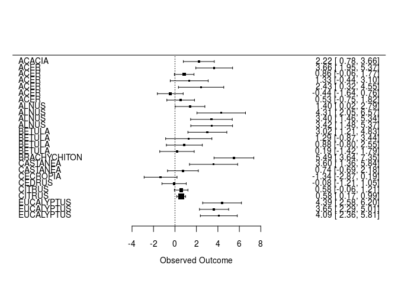
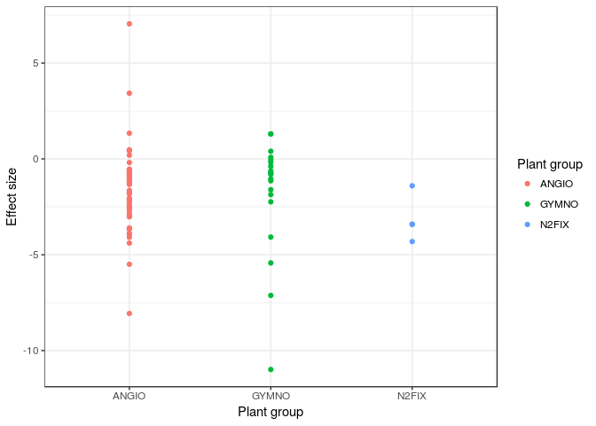
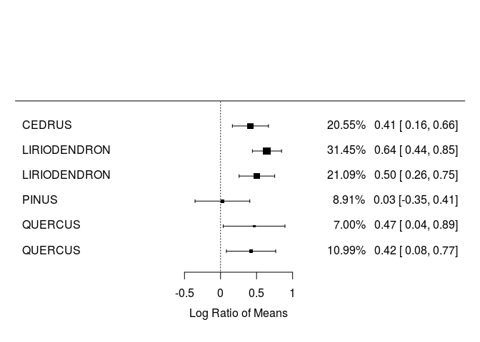

Calculating effect sizes
================

Load packages
-------------

    require(gdata)
    require(metafor)
    require(dplyr)
    require(ggplot2)

Download data
-------------

For this exercise, we'll use the Curtis et al. (1999) data set that contains an array of plant measurements taken on 65 tree species under control and elevated CO<sub>2</sub> levels This data has been extracted from 84 papers and includes mean, standard deviation, coefficient of variation, and number of observations.

``` r
curtis<-read.xls("http://www.nceas.ucsb.edu/meta/Curtis/Curtis_CO2_database.xls",as.is=TRUE,verbose=FALSE,sheet=1)

str(curtis)
```

    ## 'data.frame':    784 obs. of  29 variables:
    ##  $ OBSNO   : int  1 2 3 4 5 6 7 8 9 10 ...
    ##  $ PAP_NO  : int  44 44 44 44 44 44 44 44 44 44 ...
    ##  $ PARAM   : chr  "PN" "PN" "AGWT" "AGWT" ...
    ##  $ P_UNIT  : chr  "umolCO2/m2/s" "umolCO2/m2/s" "mg" "mg" ...
    ##  $ GENUS   : chr  "ALNUS" "ALNUS" "ALNUS" "ALNUS" ...
    ##  $ SPECIES : chr  "RUBRA" "RUBRA" "RUBRA" "RUBRA" ...
    ##  $ DIV1    : chr  "WOODY" "WOODY" "WOODY" "WOODY" ...
    ##  $ DIV2    : chr  "N2FIX" "N2FIX" "N2FIX" "N2FIX" ...
    ##  $ AMBC    : num  350 350 350 350 350 350 350 350 350 350 ...
    ##  $ ELEV    : num  650 650 650 650 650 650 650 650 650 650 ...
    ##  $ CO2_UNIT: chr  "ul/l" "ul/l" "ul/l" "ul/l" ...
    ##  $ TIME    : int  46 46 47 47 47 47 47 47 47 47 ...
    ##  $ POT     : chr  "0.5" "0.5" "0.5" "0.5" ...
    ##  $ METHOD  : chr  "GC" "GC" "GC" "GC" ...
    ##  $ STOCK   : chr  "SEED" "SEED" "SEED" "SEED" ...
    ##  $ XTRT    : chr  "FERT" "FERT" "FERT" "FERT" ...
    ##  $ LEVEL   : chr  "HI" "CONTROL" "HI" "CONTROL" ...
    ##  $ QUANT   : chr  "20mgN/l" "." "20mgN/l" "." ...
    ##  $ SOURCE  : chr  "T3" "T3" "T1" "T1" ...
    ##  $ X_AMB   : num  11.8 11.7 2500.5 1460.5 1444.5 ...
    ##  $ SE_AMB  : num  0.64 1.16 324.3 76.6 219.6 ...
    ##  $ SD_AMB  : num  1.43 2.59 725.16 171.28 491.04 ...
    ##  $ CV._AMB : num  12.8 23.3 30.5 12.3 35.7 ...
    ##  $ N_AMB   : int  5 5 5 5 5 5 5 5 5 5 ...
    ##  $ X_ELEV  : num  23.2 25.9 4076.4 1805.3 2740.6 ...
    ##  $ SE_ELEV : num  4.61 1.48 601.7 221.1 525.2 ...
    ##  $ SD_ELEV : num  10.31 3.31 1042.17 494.39 909.67 ...
    ##  $ CV._ELEV: num  46.7 13.4 27.7 28.8 36 ...
    ##  $ N_ELEV  : int  5 5 3 5 3 5 3 5 3 5 ...

Calculate effect sizes
----------------------

For the Curtis data set, the response variables are all measured on a continuous scale. This allows us to calculate a number of traditional effect sizes, including Hedge's D and the log-response ratio. In 'metafor' these effect sizes are referred to as 'SMD' and 'ROM', respectively.

In this case, we need the following variables to calculate effect sizes: mean, standard deviation, and sample size.

Additionally, sampling variances can be estimated differently. The default setting (used here) is the 'large-sample approximation' (vtype='LS'). For Hedge's D, one can also estimate 'unbiased estimates' (vtype='UB'); for log-response ratio, 'LS' calculates sampling variance without assuming homoscedasticity while 'HO' assumes that variances are the same in control and treatment groups.

Note that 'group 1' (e.g. 'm1i' , 'sd1i') correspond to the treatment group and 'group 2' (e.g. 'm2i', 'sd2i') correspond to the control group.

### Hedges' D: Photosynthesis

``` r
curtis_ES<-escalc(measure='SMD', m2i=X_AMB , sd2i=SD_AMB, n2i=N_AMB, m1i=X_ELEV, sd1i=SD_ELEV, n1i=N_ELEV, vtype='LS',var.names=c("Hedges_D","Hedges_var"),data=curtis)
```

Visualize effect sizes (part I): forest plots
---------------------------------------------

Please note that the first 25 observations are presented for visualization reasons. If you want to look at all effect sizes,
use the name of the larger data frame ('hedges\_PN') in the 'forest' function.

``` r
hedges_PN<-filter(curtis_ES, PARAM=="PN")
hedges_PN<-arrange(hedges_PN, GENUS)
hedges_PNN<-hedges_PN[1:25,]  # not necessary

forest(hedges_PNN$Hedges_D,hedges_PNN$Hedges_var, slab=hedges_PNN$GENUS, showweights=FALSE)
```



**QUESTION: Do trees have higher or lower photosynthesis under ambient or elevated CO<sub>2</sub> conditions?**

Visualize effect sizes (part II): explore moderators
----------------------------------------------------

Alternatives for visually assessing effect sizes (per group) include histograms or density distributions.

``` r
hedges_PN$SE<-sqrt(hedges_PN$Hedges_var)

dodge <- position_dodge(width=1)

ggplot(hedges_PN, aes(x=DIV2, y=Hedges_D, colour=DIV2)) + 
    geom_hline(yintercept=0,color="red")+
    #geom_errorbar(aes(ymin=Hedges_D-SE, ymax=Hedges_D+SE), width=.1,position=dodge) +
    geom_point(position=dodge)+ labs(x="Plant group", y="Effect size")+
     guides(fill=FALSE,colour=guide_legend(title="Plant group",title.position = "top"))+
  
  theme_bw()
```



**QUESTION: Are there differences among functional groups in terms of their response to elevated CO<sub>2</sub>?\#**

### LRR: water-use efficiency

The log-response ratio is a commonly used effect size and -- once back-transformed -- is easier to understand (e.g. the mean effect size is 10% greater than the control).

``` r
require(metafor,quietly = TRUE)

curtis_ES2<-escalc(measure='ROM', m2i=X_AMB , sd2i=SD_AMB, n2i=N_AMB, m1i=X_ELEV, sd1i=SD_ELEV, n1i=N_ELEV, vtype='LS',var.names=c("LRR","LRR_var"),data=curtis)
```

    ## Warning in log(m1i/m2i): NaNs produced

``` r
str(curtis_ES2)
```

    ## Classes 'escalc' and 'data.frame':   784 obs. of  31 variables:
    ##  $ OBSNO   : int  1 2 3 4 5 6 7 8 9 10 ...
    ##  $ PAP_NO  : int  44 44 44 44 44 44 44 44 44 44 ...
    ##  $ PARAM   : chr  "PN" "PN" "AGWT" "AGWT" ...
    ##  $ P_UNIT  : chr  "umolCO2/m2/s" "umolCO2/m2/s" "mg" "mg" ...
    ##  $ GENUS   : chr  "ALNUS" "ALNUS" "ALNUS" "ALNUS" ...
    ##  $ SPECIES : chr  "RUBRA" "RUBRA" "RUBRA" "RUBRA" ...
    ##  $ DIV1    : chr  "WOODY" "WOODY" "WOODY" "WOODY" ...
    ##  $ DIV2    : chr  "N2FIX" "N2FIX" "N2FIX" "N2FIX" ...
    ##  $ AMBC    : num  350 350 350 350 350 350 350 350 350 350 ...
    ##  $ ELEV    : num  650 650 650 650 650 650 650 650 650 650 ...
    ##  $ CO2_UNIT: chr  "ul/l" "ul/l" "ul/l" "ul/l" ...
    ##  $ TIME    : int  46 46 47 47 47 47 47 47 47 47 ...
    ##  $ POT     : chr  "0.5" "0.5" "0.5" "0.5" ...
    ##  $ METHOD  : chr  "GC" "GC" "GC" "GC" ...
    ##  $ STOCK   : chr  "SEED" "SEED" "SEED" "SEED" ...
    ##  $ XTRT    : chr  "FERT" "FERT" "FERT" "FERT" ...
    ##  $ LEVEL   : chr  "HI" "CONTROL" "HI" "CONTROL" ...
    ##  $ QUANT   : chr  "20mgN/l" "." "20mgN/l" "." ...
    ##  $ SOURCE  : chr  "T3" "T3" "T1" "T1" ...
    ##  $ X_AMB   : num  11.8 11.7 2500.5 1460.5 1444.5 ...
    ##  $ SE_AMB  : num  0.64 1.16 324.3 76.6 219.6 ...
    ##  $ SD_AMB  : num  1.43 2.59 725.16 171.28 491.04 ...
    ##  $ CV._AMB : num  12.8 23.3 30.5 12.3 35.7 ...
    ##  $ N_AMB   : int  5 5 5 5 5 5 5 5 5 5 ...
    ##  $ X_ELEV  : num  23.2 25.9 4076.4 1805.3 2740.6 ...
    ##  $ SE_ELEV : num  4.61 1.48 601.7 221.1 525.2 ...
    ##  $ SD_ELEV : num  10.31 3.31 1042.17 494.39 909.67 ...
    ##  $ CV._ELEV: num  46.7 13.4 27.7 28.8 36 ...
    ##  $ N_ELEV  : int  5 5 3 5 3 5 3 5 3 5 ...
    ##  $ LRR     : atomic  0.679 0.795 0.489 0.212 0.64 ...
    ##   ..- attr(*, "measure")= chr "ROM"
    ##   ..- attr(*, "ni")= int  10 10 8 10 8 10 8 10 8 10 ...
    ##  $ LRR_var : num  0.0424 0.0131 0.0386 0.0178 0.0598 ...
    ##  - attr(*, "digits")= num 4
    ##  - attr(*, "yi.names")= chr "LRR"
    ##  - attr(*, "vi.names")= chr "LRR_var"

Visualize effect sizes (part I) : forest plots
----------------------------------------------

``` r
require(metafor,quietly = TRUE)
require(dplyr,quietly=TRUE)

LRR_WUE<-filter(curtis_ES2, PARAM=="WUE")
LRR_WUE<-arrange(LRR_WUE, GENUS)

forest(LRR_WUE$LRR,LRR_WUE$LRR_var, slab=LRR_WUE$GENUS, showweights=TRUE)
```



Note that the percentage next to each effect size is the weight of each point.

**QUESTION: Do trees have higher or lower water-use efficiency in response to elevated CO<sub>2</sub>?**

### Exercise: calculate effect sizes and create forest plots using the [Stewart et al. bird abundance dataset](https://www.dropbox.com/s/rdv7cj11dh9s38x/borenstein2010.pdf?dl=0)
