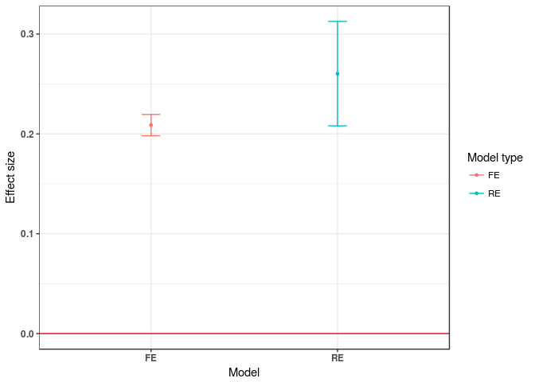
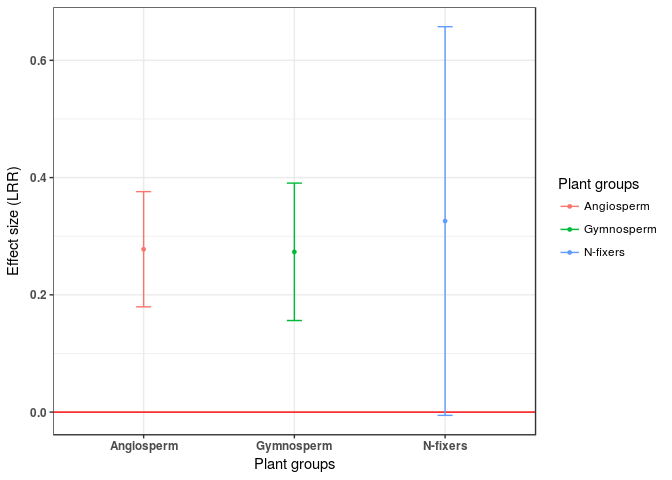

Hierarchical meta-analytical models
================

Getting started
---------------

*Load packages*

    require(gdata)
    require(metafor)
    require(dplyr)
    require(multcomp)
    require(ggplot2)

*Download data (Curtis et al. 1999)*

``` r
curtis<-read.xls("http://www.nceas.ucsb.edu/meta/Curtis/Curtis_CO2_database.xls",as.is=TRUE,verbose=FALSE,sheet=1)
curtis_ES<-escalc(measure='ROM', m2i=X_AMB , sd2i=SD_AMB, n2i=N_AMB, m1i=X_ELEV, sd1i=SD_ELEV, n1i=N_ELEV, vtype='LS',var.names=c("LRR","LRR_var"),data=curtis)
```

    ## Warning in log(m1i/m2i): NaNs produced

``` r
summary(as.factor(curtis_ES$PARAM))
```

    ##   AGWT     BD   BGWT   CRWT   FRWT     GS  GS_AC     HT  INDLA   JMAX 
    ##     14     25     64     11      9     49     12     30      3      3 
    ##    LAR    LFC   LFNA   LFNM    LFP LFSTAR  LFSUG  LFTNC   LFWT  MAXLA 
    ##     15      3     15     42      5     19     11      7     50     41 
    ##   PIRC     PN  PN_AC     RD  RD_AC    RGR SEEDWT    SLA    SLW   STWT 
    ##      2     79     29     17      3     17      1     18     15     47 
    ##   TOTN  TOTWT  VCMAX    WUE WUE_AC 
    ##      9    102      9      6      2

``` r
curtis_WT<-filter(curtis_ES, PARAM=="TOTWT") # let's use whole plant weight because it has the largest number of observations   

curtis_WT$GEN_SPP<-paste(curtis_WT$GENUS,curtis_WT$SPECIES,sep="_")
```

Part I: compare fixed and random effects models
-----------------------------------------------

### Fixed effects model

**Important** Fixed effects models assume that there is one true effect size, i.e. differences are largely due to sampling error.

``` r
fix_wt<-rma(LRR, LRR_var, method="FE", data=curtis_WT)

summary(fix_wt)
```

    ## 
    ## Fixed-Effects Model (k = 102)
    ## 
    ##    logLik   deviance        AIC        BIC       AICc  
    ## -245.9580   769.0185   493.9160   496.5410   493.9560  
    ## 
    ## Test for Heterogeneity: 
    ## Q(df = 101) = 769.0185, p-val < .0001
    ## 
    ## Model Results:
    ## 
    ## estimate      se     zval    pval   ci.lb   ci.ub     
    ##   0.2088  0.0054  38.3374  <.0001  0.1982  0.2195  ***
    ## 
    ## ---
    ## Signif. codes:  0 '***' 0.001 '**' 0.01 '*' 0.05 '.' 0.1 ' ' 1

This model estimates the 'grand mean' of the effect of CO<sub>2</sub> exposure on total plant weight.

### Random effects model

**Important** Random effects models allows the true effect size to differ.
Here, the effect sizes represent a random sample from a particular distribution.

You can use either the 'rma' function, which uses REML as the default method for fitting a model, or 'rma.mv', which requires that you specify the random effects.

Here, we use a random group term for each study ('PAP\_NO') because many studies report more than one effect size.

    ## [1] 3.517241

``` r
re_wt<-rma.mv(LRR, LRR_var, random=~1|PAP_NO, data=curtis_WT)

summary(re_wt)
```

    ## 
    ## Multivariate Meta-Analysis Model (k = 102; method: REML)
    ## 
    ##   logLik  Deviance       AIC       BIC      AICc  
    ## -50.0285  100.0570  104.0570  109.2872  104.1794  
    ## 
    ## Variance Components: 
    ## 
    ##             estim    sqrt  nlvls  fixed  factor
    ## sigma^2    0.0147  0.1212     29     no  PAP_NO
    ## 
    ## Test for Heterogeneity: 
    ## Q(df = 101) = 769.0185, p-val < .0001
    ## 
    ## Model Results:
    ## 
    ## estimate      se    zval    pval   ci.lb   ci.ub     
    ##   0.2603  0.0267  9.7528  <.0001  0.2080  0.3127  ***
    ## 
    ## ---
    ## Signif. codes:  0 '***' 0.001 '**' 0.01 '*' 0.05 '.' 0.1 ' ' 1

This model also estimates the 'grand mean' of the effect of CO<sub>2</sub> exposure on total plant weight.



**Comparison of model heterogeneity**

Note that *I<sup>2</sup>* for the random effects model integrates heterogeneity from within- and between-clusters following Nakagawa & Santos (2012).

See [here](http://www.metafor-project.org/doku.php/tips:i2_multilevel_multivariate) to calculate *I<sup>2</sup>* for between- and within-clusters of multilevel models separately.

``` r
I2_fe<-cbind.data.frame("model"="fixed","I2"=fix_wt$I2) 

#######################################
# calcualte I2 for a multilevel model #
#######################################
W <- diag(1/curtis_WT$LRR_var)
X <- model.matrix(re_wt)
P <- W - W %*% X %*% solve(t(X) %*% W %*% X) %*% t(X) %*% W
re_I2<-100 * sum(re_wt$sigma2) / (sum(re_wt$sigma2) + (re_wt$k-re_wt$p)/sum(diag(P)))

I2_re<-cbind.data.frame("model"="random","I2"=re_I2)

#######################################

I22<-rbind.data.frame(I2_fe,I2_re)
I22
```

    ##    model       I2
    ## 1  fixed 86.86638
    ## 2 random 81.76727

Part II: Hierarchical, multi-level model ('meta-regression')
------------------------------------------------------------

**Identify most parsimonious random-effects structure**

I've included additional random effects included in the data set: extra treatment (e.g. nutrient addition, light, water), species identity, and a combination of the two.

``` r
re_wt1<-rma.mv(LRR, LRR_var, mods=~DIV2,random=~1|PAP_NO, data=curtis_WT)

re_wt2<-rma.mv(LRR, LRR_var, mods=~DIV2,random=list(~1|PAP_NO, ~1|XTRT), data=curtis_WT)

re_wt3<-rma.mv(LRR, LRR_var, mods=~DIV2,random=list(~1|PAP_NO, ~1|GEN_SPP), data=curtis_WT)

re_wt4<-rma.mv(LRR, LRR_var, mods=~DIV2,random=list(~1|PAP_NO, ~1|XTRT, ~1|GEN_SPP), data=curtis_WT)

AICc<-rbind(mod1=re_wt1$fit.stats$REML[5],mod2=re_wt2$fit.stats$REML[5],mod3=re_wt3$fit.stats$REML[5],mod4=re_wt4$fit.stats$REML[5])

AICc  # and the winner is ... 
```

    ##           [,1]
    ## mod1 110.91380
    ## mod2  74.29536
    ## mod3  87.97844
    ## mod4  54.58859

**Test significance of moderators**

There are a couple of ways to test the signifance of moderator variables.

*Likelihood Ratio Tests*

Note that maximum likelihood is used to fit both models

``` r
bigg<-rma.mv(LRR, LRR_var, mods=~DIV2,random=list(~1|PAP_NO, ~1|XTRT, ~1|GEN_SPP), data=curtis_WT, method="ML")
small<-rma.mv(LRR, LRR_var, mods=~1,random=list(~1|PAP_NO, ~1|XTRT, ~1|GEN_SPP), data=curtis_WT, method="ML")

anova(bigg,small)
```

    ##         df     AIC     BIC    AICc   logLik    LRT   pval       QE
    ## Full     6 51.7179 67.4677 52.6021 -19.8589               719.5615
    ## Reduced  4 47.8123 58.3122 48.2247 -19.9062 0.0945 0.9539 769.0185

*Knapp & Hartung Adjustment*

The Knapp & Hartung adjustment, similar to the likelihood ratio test, can be used for individual model coefficients (t-tests) or a group of model coefficients (F tests).

``` r
bigg<-rma.mv(LRR, LRR_var, mods=~DIV2,random=list(~1|PAP_NO, ~1|XTRT, ~1|GEN_SPP), data=curtis_WT, test="knha")

summary(bigg)
```

    ## 
    ## Multivariate Meta-Analysis Model (k = 102; method: REML)
    ## 
    ##   logLik  Deviance       AIC       BIC      AICc  
    ## -20.8378   41.6755   53.6755   69.2463   54.5886  
    ## 
    ## Variance Components: 
    ## 
    ##             estim    sqrt  nlvls  fixed   factor
    ## sigma^2.1  0.0104  0.1019     29     no   PAP_NO
    ## sigma^2.2  0.0093  0.0965      8     no     XTRT
    ## sigma^2.3  0.0042  0.0649     37     no  GEN_SPP
    ## 
    ## Test for Residual Heterogeneity: 
    ## QE(df = 99) = 719.5615, p-val < .0001
    ## 
    ## Test of Moderators (coefficient(s) 2:3): 
    ## QM(df = 2) = 0.0914, p-val = 0.9553
    ## 
    ## Model Results:
    ## 
    ##            estimate      se     zval    pval    ci.lb   ci.ub     
    ## intrcpt      0.2778  0.0501   5.5423  <.0001   0.1796  0.3760  ***
    ## DIV2GYMNO   -0.0044  0.0560  -0.0788  0.9372  -0.1142  0.1054     
    ## DIV2N2FIX    0.0481  0.1687   0.2852  0.7755  -0.2826  0.3788     
    ## 
    ## ---
    ## Signif. codes:  0 '***' 0.001 '**' 0.01 '*' 0.05 '.' 0.1 ' ' 1

In both cases, including plant group as a moderator variable did not add information to the model.

*Model Heterogeneity (I<sup>2</sup>)*

``` r
W <- diag(1/curtis_WT$LRR_var)
X <- model.matrix(bigg)
P <- W - W %*% X %*% solve(t(X) %*% W %*% X) %*% t(X) %*% W
100 * sum(bigg$sigma2) / (sum(bigg$sigma2) + (bigg$k-bigg$p)/sum(diag(P)))
```

    ## [1] 86.99147

Note that the *I<sup>2</sup>* for this model is very similar to that of the fixed effects model and the random effects model with a simpler random effects structure (seen earlier).

**Pairwise comparisons**

We will use the 'multcomp' package to test contrasts between levels of the factor 'DIV2'.

``` r
require(multcomp)

bigg_int<-rma.mv(LRR, LRR_var, mods=~DIV2-1,random=list(~1|PAP_NO, ~1|XTRT, ~1|GEN_SPP), data=curtis_WT, test="knha")

summary(bigg_int)
```

    ## 
    ## Multivariate Meta-Analysis Model (k = 102; method: REML)
    ## 
    ##   logLik  Deviance       AIC       BIC      AICc  
    ## -20.8378   41.6755   53.6755   69.2463   54.5886  
    ## 
    ## Variance Components: 
    ## 
    ##             estim    sqrt  nlvls  fixed   factor
    ## sigma^2.1  0.0104  0.1019     29     no   PAP_NO
    ## sigma^2.2  0.0093  0.0965      8     no     XTRT
    ## sigma^2.3  0.0042  0.0649     37     no  GEN_SPP
    ## 
    ## Test for Residual Heterogeneity: 
    ## QE(df = 99) = 719.5615, p-val < .0001
    ## 
    ## Test of Moderators (coefficient(s) 1:3): 
    ## QM(df = 3) = 36.2522, p-val < .0001
    ## 
    ## Model Results:
    ## 
    ##            estimate      se    zval    pval    ci.lb   ci.ub     
    ## DIV2ANGIO    0.2778  0.0501  5.5423  <.0001   0.1796  0.3760  ***
    ## DIV2GYMNO    0.2734  0.0598  4.5721  <.0001   0.1562  0.3906  ***
    ## DIV2N2FIX    0.3259  0.1691  1.9273  0.0539  -0.0055  0.6574    .
    ## 
    ## ---
    ## Signif. codes:  0 '***' 0.001 '**' 0.01 '*' 0.05 '.' 0.1 ' ' 1

``` r
summary(glht(bigg_int, linfct=rbind(c(-1,1,0), c(-1,0,1), c(0,-1,1))), test=adjusted("none"))
```

    ## 
    ##   Simultaneous Tests for General Linear Hypotheses
    ## 
    ## Fit: rma.mv(yi = LRR, V = LRR_var, mods = ~DIV2 - 1, random = list(~1 | 
    ##     PAP_NO, ~1 | XTRT, ~1 | GEN_SPP), data = curtis_WT, test = "knha")
    ## 
    ## Linear Hypotheses:
    ##         Estimate Std. Error z value Pr(>|z|)
    ## 1 == 0 -0.004411   0.056006  -0.079    0.937
    ## 2 == 0  0.048123   0.168718   0.285    0.775
    ## 3 == 0  0.052534   0.173766   0.302    0.762
    ## (Adjusted p values reported -- none method)



Exercise: download data from our Github repository and fit a multi-level model, calculate I<sup>2</sup>, and test for multiple comparisons.
-------------------------------------------------------------------------------------------------------------------------------------------

    install.packages('RCurl')

    require(RCurl)
    landuse <- getURL("https://raw.githubusercontent.com/dylancraven/MetaAnalysis_Course/gh-pages/Slides/LandUseBiodiv.csv")
    landuse <- read.csv(text = landuse,header=T)
