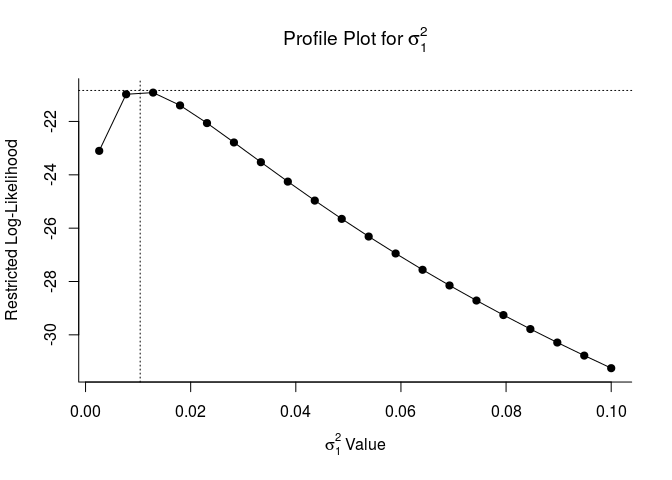
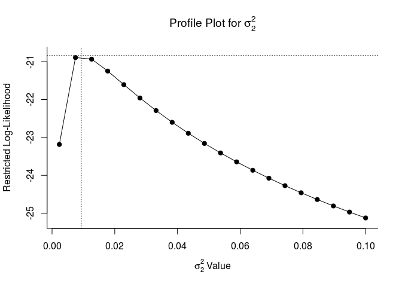
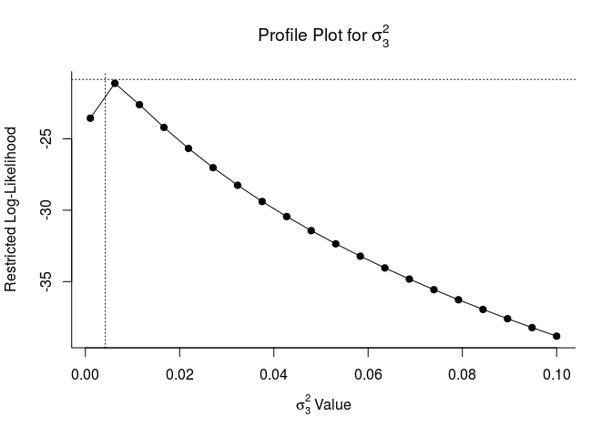
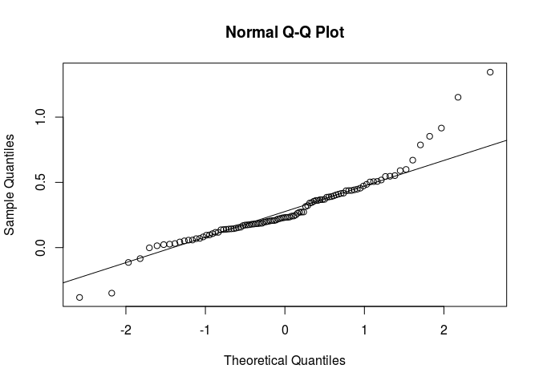
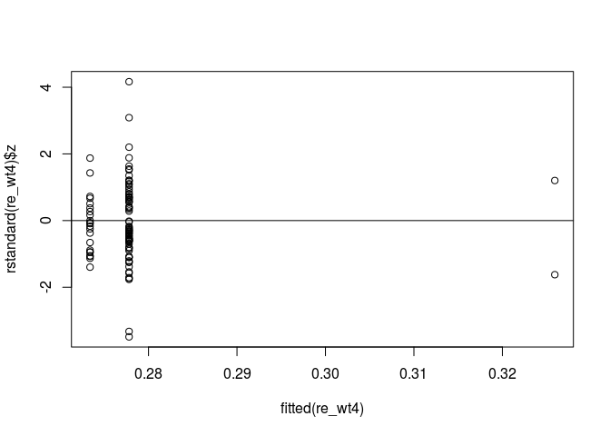
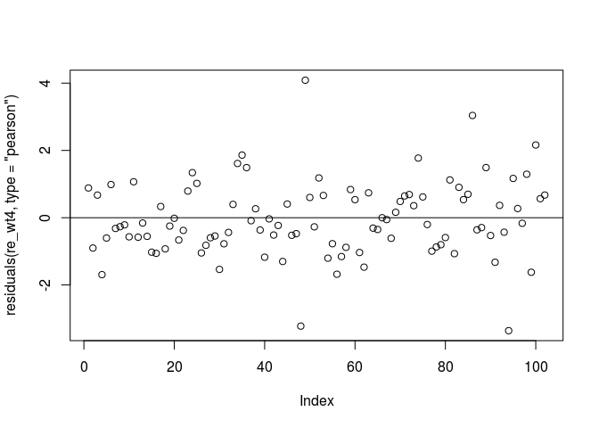
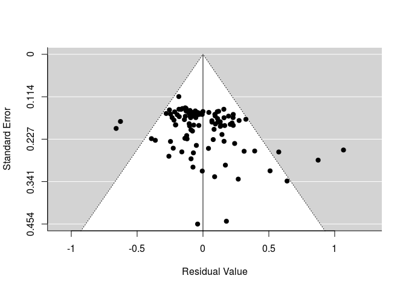
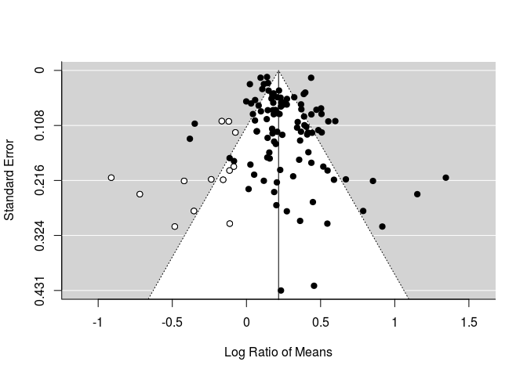

Assumptions and biases
================

Getting started
---------------

We'll continue using the same data and model from previous days.

*Load packages*

    require(gdata)
    require(metafor)
    require(dplyr)

*Download data (Curtis et al. 1999)*

``` r
curtis<-read.xls("http://www.nceas.ucsb.edu/meta/Curtis/Curtis_CO2_database.xls",as.is=TRUE,verbose=FALSE,sheet=1)
curtis_ES<-escalc(measure='ROM', m2i=X_AMB , sd2i=SD_AMB, n2i=N_AMB, m1i=X_ELEV, sd1i=SD_ELEV, n1i=N_ELEV, vtype='LS',var.names=c("LRR","LRR_var"),data=curtis)
```

    ## Warning in log(m1i/m2i): NaNs produced

``` r
#summary(as.factor(curtis_ES$PARAM))
curtis_WT<-filter(curtis_ES, PARAM=="TOTWT") # let's use whole plant weight because it has the largest number of observations   

curtis_WT$GEN_SPP<-paste(curtis_WT$GENUS,curtis_WT$SPECIES,sep="_")
```

    ## 
    ## Multivariate Meta-Analysis Model (k = 102; method: REML)
    ## 
    ##   logLik  Deviance       AIC       BIC      AICc  
    ## -20.8378   41.6755   53.6755   69.2463   54.5886  
    ## 
    ## Variance Components: 
    ## 
    ##             estim    sqrt  nlvls  fixed   factor
    ## sigma^2.1  0.0104  0.1019     29     no   PAP_NO
    ## sigma^2.2  0.0093  0.0965      8     no     XTRT
    ## sigma^2.3  0.0042  0.0649     37     no  GEN_SPP
    ## 
    ## Test for Residual Heterogeneity: 
    ## QE(df = 99) = 719.5615, p-val < .0001
    ## 
    ## Test of Moderators (coefficient(s) 2:3): 
    ## QM(df = 2) = 0.0914, p-val = 0.9553
    ## 
    ## Model Results:
    ## 
    ##            estimate      se     zval    pval    ci.lb   ci.ub     
    ## intrcpt      0.2778  0.0501   5.5423  <.0001   0.1796  0.3760  ***
    ## DIV2GYMNO   -0.0044  0.0560  -0.0788  0.9372  -0.1142  0.1054     
    ## DIV2N2FIX    0.0481  0.1687   0.2852  0.7755  -0.2826  0.3788     
    ## 
    ## ---
    ## Signif. codes:  0 '***' 0.001 '**' 0.01 '*' 0.05 '.' 0.1 ' ' 1

Assess model assumptions: homogeneity of variance and normality
---------------------------------------------------------------

**Profile likelihood plots**

These plots let us know if model parameters are 'identifiable'. If they are identifiable, they peak at their estimates. If they are not, they may be flat which indicates that the model does not converge or is overparameterized. This is a fancy way of sayin that model estimates will be more reliable with a simpler random effects structure.

    ## Profiling sigma2 = 1 
    ## 
      |                                                                       
      |                                                                 |   0%
      |                                                                       
      |===                                                              |   5%
      |                                                                       
      |======                                                           |  10%
      |                                                                       
      |==========                                                       |  15%
      |                                                                       
      |=============                                                    |  20%
      |                                                                       
      |================                                                 |  25%
      |                                                                       
      |====================                                             |  30%
      |                                                                       
      |=======================                                          |  35%
      |                                                                       
      |==========================                                       |  40%
      |                                                                       
      |=============================                                    |  45%
      |                                                                       
      |================================                                 |  50%
      |                                                                       
      |====================================                             |  55%
      |                                                                       
      |=======================================                          |  60%
      |                                                                       
      |==========================================                       |  65%
      |                                                                       
      |==============================================                   |  70%
      |                                                                       
      |=================================================                |  75%
      |                                                                       
      |====================================================             |  80%
      |                                                                       
      |=======================================================          |  85%
      |                                                                       
      |==========================================================       |  90%
      |                                                                       
      |==============================================================   |  95%
      |                                                                       
      |=================================================================| 100%



    ## Profiling sigma2 = 2 
    ## 
      |                                                                       
      |                                                                 |   0%
      |                                                                       
      |===                                                              |   5%
      |                                                                       
      |======                                                           |  10%
      |                                                                       
      |==========                                                       |  15%
      |                                                                       
      |=============                                                    |  20%
      |                                                                       
      |================                                                 |  25%
      |                                                                       
      |====================                                             |  30%
      |                                                                       
      |=======================                                          |  35%
      |                                                                       
      |==========================                                       |  40%
      |                                                                       
      |=============================                                    |  45%
      |                                                                       
      |================================                                 |  50%
      |                                                                       
      |====================================                             |  55%
      |                                                                       
      |=======================================                          |  60%
      |                                                                       
      |==========================================                       |  65%
      |                                                                       
      |==============================================                   |  70%
      |                                                                       
      |=================================================                |  75%
      |                                                                       
      |====================================================             |  80%
      |                                                                       
      |=======================================================          |  85%
      |                                                                       
      |==========================================================       |  90%
      |                                                                       
      |==============================================================   |  95%
      |                                                                       
      |=================================================================| 100%



    ## Profiling sigma2 = 3 
    ## 
      |                                                                       
      |                                                                 |   0%
      |                                                                       
      |===                                                              |   5%
      |                                                                       
      |======                                                           |  10%
      |                                                                       
      |==========                                                       |  15%
      |                                                                       
      |=============                                                    |  20%
      |                                                                       
      |================                                                 |  25%
      |                                                                       
      |====================                                             |  30%
      |                                                                       
      |=======================                                          |  35%
      |                                                                       
      |==========================                                       |  40%
      |                                                                       
      |=============================                                    |  45%
      |                                                                       
      |================================                                 |  50%
      |                                                                       
      |====================================                             |  55%
      |                                                                       
      |=======================================                          |  60%
      |                                                                       
      |==========================================                       |  65%
      |                                                                       
      |==============================================                   |  70%
      |                                                                       
      |=================================================                |  75%
      |                                                                       
      |====================================================             |  80%
      |                                                                       
      |=======================================================          |  85%
      |                                                                       
      |==========================================================       |  90%
      |                                                                       
      |==============================================================   |  95%
      |                                                                       
      |=================================================================| 100%



**Quantile-Quantile plots**

``` r
qqnorm(curtis_WT$LRR)
qqline(curtis_WT$LRR)
```



**Model residuals**

*Residuals vs. fitted*

``` r
plot(fitted(re_wt4), rstandard(re_wt4)$z)
abline(h =0)
```



*Pearson model residuals*

``` r
plot(residuals(re_wt4, type="pearson"))
abline(h =0)
```



**Influential points or outliers**

*Cook's distance*

This plot helps you find outliers and influential points.

``` r
plot(cooks.distance(re_wt4))
```


Publication bias
----------------

There are two main ways of detecting publication bias:
1) by testing if effect sizes are unusually high (i.e. asymmetric) or
2) estimating the number of studies needed to change the signficance of a mean effect size.

**Funnel plot**

``` r
funnel(re_wt4)
```



**Egger's regression**

Egger's regression tests for funnel plot asymmetry. One can use a number of moderators; the most common are the inverse of sampling variance or standard errors.

    ```r
       test.egger = rma.mv(LRR,LRR_var, mod = LRR_var, random=list(~1|PAP_NO, ~1|XTRT, ~1|GEN_SPP), data = curtis_WT)  
       
    summary(test.egger)
    ```

    ```
    ## 
    ## Multivariate Meta-Analysis Model (k = 102; method: REML)
    ## 
    ##   logLik  Deviance       AIC       BIC      AICc  
    ## -18.1427   36.2853   46.2853   59.3112   46.9236  
    ## 
    ## Variance Components: 
    ## 
    ##             estim    sqrt  nlvls  fixed   factor
    ## sigma^2.1  0.0102  0.1009     29     no   PAP_NO
    ## sigma^2.2  0.0074  0.0861      8     no     XTRT
    ## sigma^2.3  0.0033  0.0579     37     no  GEN_SPP
    ## 
    ## Test for Residual Heterogeneity: 
    ## QE(df = 100) = 740.2733, p-val < .0001
    ## 
    ## Test of Moderators (coefficient(s) 2): 
    ## QM(df = 1) = 4.0127, p-val = 0.0452
    ## 
    ## Model Results:
    ## 
    ##          estimate      se    zval    pval   ci.lb   ci.ub     
    ## intrcpt    0.2534  0.0445  5.6963  <.0001  0.1662  0.3406  ***
    ## mods       1.9360  0.9665  2.0032  0.0452  0.0418  3.8303    *
    ## 
    ## ---
    ## Signif. codes:  0 '***' 0.001 '**' 0.01 '*' 0.05 '.' 0.1 ' ' 1
    ```

*Note that there is a function in metafor ('regtest') for more simple models.*

**Fail-safe number**

How many studies (or observations) would be needed to make the mean effect size effectively zero?

Note that the 'Rosenberg' and 'Rosenthal' methods estimates *weighted* effect sizes, while the 'Orwin' method estimates *unweighted* effect sizes. This methodological difference explains the contrasting magnitudes of the estimated fail-safe numbers.

``` r
fsn(LRR, LRR_var, data=curtis_WT,type="Rosenberg")
```

    ## 
    ## Fail-safe N Calculation Using the Rosenberg Approach 
    ## 
    ## Average Effect Size:         0.2088 
    ## Observed Significance Level: <.0001 
    ## Target Significance Level:   0.05 
    ## 
    ## Fail-safe N: 38924

``` r
fsn(LRR, LRR_var, data=curtis_WT,type="Rosenthal")
```

    ## 
    ## Fail-safe N Calculation Using the Rosenthal Approach 
    ## 
    ## Observed Significance Level: <.0001 
    ## Target Significance Level:   0.05 
    ## 
    ## Fail-safe N: 36162

``` r
fsn(LRR, LRR_var, data=curtis_WT,type="Orwin")
```

    ## 
    ## Fail-safe N Calculation Using the Orwin Approach 
    ## 
    ## Average Effect Size: 0.2844 
    ## Target Effect Size:  0.1422 
    ## 
    ## Fail-safe N: 102

**Trim & fill**

Trim & fill is a method to estimate the missing number of studies, possibly due to biases (publication or others) that omit or exclude the inclusion of extreme results. Doing so makes the funnel plot more symmetric.

Trim & fill is not currently implemented for 'rma.mv' objects, but can be done easily for either fixed or random effect models.

``` r
ree<-rma(LRR, LRR_var, data=curtis_WT)

taf <- trimfill(ree)

taf$k0 #number of studies to add
```

    ## [1] 13

``` r
taf$side #which side should they be added to?
```

    ## [1] "left"

``` r
funnel(taf)
```



Note that points in *white* are those added by the trim-and-fill analysis.
