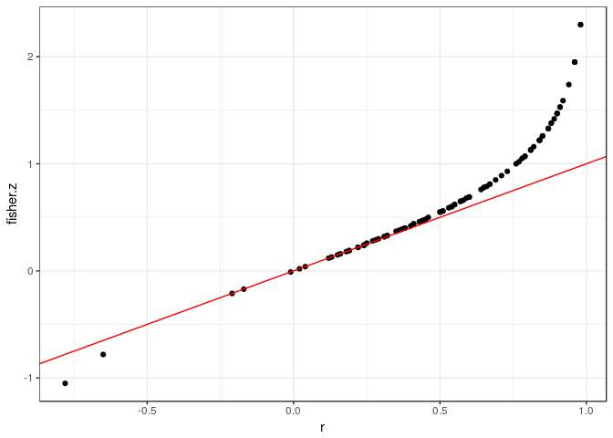
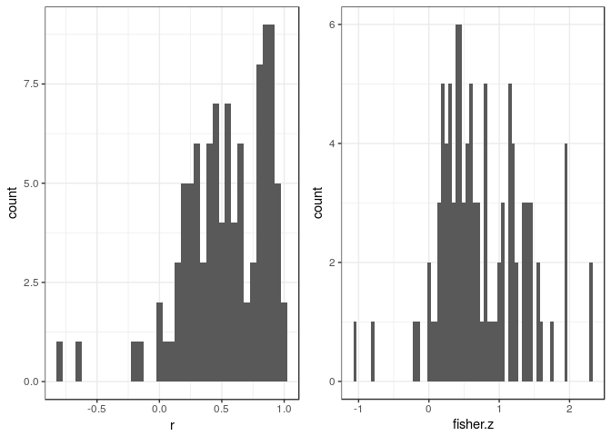
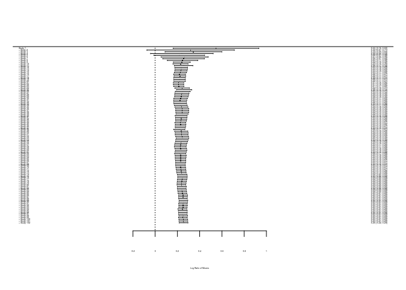

Confounding effects and extra tricks
================

Getting started
---------------

We'll continue using the same data from previous days.

*Load packages*

    require(gdata)
    require(metafor)
    require(dplyr)
    require(compute.es)
    require(ggplot2)
    require(cowplot)

*Download data (Curtis et al. 1999)*

    ## Warning in log(m1i/m2i): NaNs produced

Conversion among effect sizes
-----------------------------

'Compute.es' is a powerful package that converts effect sizes.

The main function for calculating effect sizes is *mes* and *des* ,and *res* convert among effect sizes.

Here, we will first calculate basic effect sizes using *mes* and then convert the effect size *r* to Fisher's *z*

``` r
# calculate effect sizes
curtis_ES<-mes(m.2=curtis_WT$X_AMB, m.1=curtis_WT$X_ELEV, sd.2=curtis_WT$SD_AMB, sd.1=curtis_WT$SD_ELEV, n.2=curtis_WT$N_AMB, n.1=curtis_WT$N_ELEV ,verbose=FALSE)


# convert correlation coefficient to fisher's z  
new_ES<-res(r=curtis_ES$r,var.r=curtis_ES$var.r, n=curtis_ES$N.total,verbose=FALSE)

curtis_ESS<-dplyr::select(new_ES, r, var.r, N.total, fisher.z, var.z)

head(curtis_ESS)
```

    ##       r var.r N.total fisher.z var.z
    ## 1  0.71  0.02       8     0.89  0.20
    ## 2  0.31  0.08      10     0.32  0.14
    ## 3  0.59  0.03      10     0.68  0.14
    ## 4 -0.21  0.09      10    -0.21  0.14
    ## 5  0.19  0.11       8     0.19  0.20
    ## 6  0.81  0.01       8     1.13  0.20

``` r
r_z<-ggplot(curtis_ESS, aes(x=r, y=fisher.z))+geom_point() +theme_bw()

r_z
```



``` r
hist_r<-ggplot(curtis_ESS, aes(r)) +
  geom_histogram(binwidth = 0.05)+theme_bw()


hist_z<-ggplot(curtis_ESS, aes(fisher.z)) +
  geom_histogram(binwidth = 0.05)+theme_bw()

ab<-plot_grid(hist_r, hist_z, ncol=2)
ab
```



Cumulative meta-analysis
------------------------

This method tests whether effect sizes have shifted over time.

``` r
re_wt<-rma(LRR, LRR_var, data=curtis_WT)

cum_re<-cumul(re_wt, order(curtis_WT$OBSNO))

forest.cumul.rma(cum_re)
```



Controlling for shared evolutionary history (phylogeny)
-------------------------------------------------------
