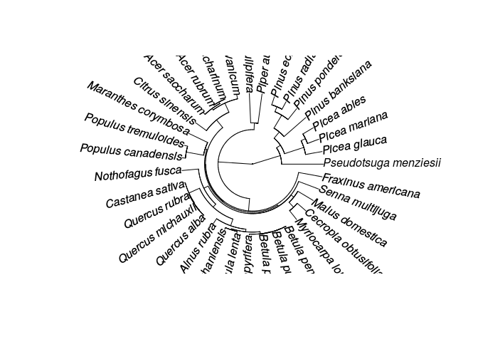

Build a phylogeny
================

*Load packages*

    require(gdata)
    require(metafor)
    require(dplyr)
    require(pez)
    require(phytools)
    require(ape)

    ## Warning in log(m1i/m2i): NaNs produced

**Clean species names**

Species names are taxonomically resolved using [The Plant List](http://www.theplantlist.org/)

``` r
curtis_WT$GENUS<-tolower(as.character(curtis_WT$GENUS))
curtis_WT$GENUS<-paste(toupper(substr(curtis_WT$GENUS, 1, 1)), substr(curtis_WT$GENUS, 2, nchar(curtis_WT$GENUS)), sep="")

curtis_WT$SPECIES<-tolower(as.character(curtis_WT$SPECIES))
curtis_WT$GEN_SPP2<-as.character(paste(curtis_WT$GENUS, curtis_WT$SPECIES,sep=" "))

curtis_WT$GEN_SPP2<-ifelse(curtis_WT$GEN_SPP2=="Populusx euramericana","Populus × euramericana",curtis_WT$GEN_SPP2)

spp<-unique(as.character(curtis_WT$GEN_SPP2))

spp2 <- TPL(spp, corr = TRUE, repeats=10) # repeats allows you to re-connect to the TPL server
```

    ## Warning in file(file, "rt"): URL 'http://www.theplantlist.org/tpl1.1/
    ## search?q=Pinus+banksiana&csv=true': status was 'Couldn't connect to server'

``` r
spp2$new_species<-paste(spp2$New.Genus, spp2$New.Species,sep="_")

head(spp2)
```

    ##              Taxon    Genus Hybrid.marker     Species Abbrev
    ## 1      Alnus rubra    Alnus                     rubra   <NA>
    ## 2      Acer rubrum     Acer                    rubrum   <NA>
    ## 3   Quercus prinus  Quercus                    prinus   <NA>
    ## 4  Malus domestica    Malus                 domestica   <NA>
    ## 5 Acer saccharinum     Acer               saccharinum   <NA>
    ## 6  Castanea sativa Castanea                    sativa   <NA>
    ##   Infraspecific.rank Infraspecific Authority          ID Plant.Name.Index
    ## 1               <NA>                            kew-6584             TRUE
    ## 2               <NA>                         kew-2616329             TRUE
    ## 3               <NA>                          kew-174525             TRUE
    ## 4               <NA>                             rjp-454             TRUE
    ## 5               <NA>                         kew-2616367             TRUE
    ## 6               <NA>                           kew-35042             TRUE
    ##   TPL.version Taxonomic.status      Family New.Genus New.Hybrid.marker
    ## 1         1.1         Accepted  Betulaceae     Alnus                  
    ## 2         1.1         Accepted Sapindaceae      Acer                  
    ## 3         1.1          Synonym    Fagaceae   Quercus                  
    ## 4         1.1         Accepted    Rosaceae     Malus                  
    ## 5         1.1         Accepted Sapindaceae      Acer                  
    ## 6         1.1         Accepted    Fagaceae  Castanea                  
    ##   New.Species New.Infraspecific.rank New.Infraspecific New.Authority
    ## 1       rubra                                                  Bong.
    ## 2      rubrum                                                     L.
    ## 3   michauxii                                                  Nutt.
    ## 4   domestica                                                 Borkh.
    ## 5 saccharinum                                                     L.
    ## 6      sativa                                                  Mill.
    ##        New.ID New.Taxonomic.status  Typo WFormat Higher.level       Date
    ## 1    kew-6584             Accepted FALSE   FALSE        FALSE 2017-10-18
    ## 2 kew-2616329             Accepted FALSE   FALSE        FALSE 2017-10-18
    ## 3  kew-173929             Accepted FALSE   FALSE        FALSE 2017-10-18
    ## 4     rjp-454             Accepted FALSE   FALSE        FALSE 2017-10-18
    ## 5 kew-2616367             Accepted FALSE   FALSE        FALSE 2017-10-18
    ## 6   kew-35042             Accepted FALSE   FALSE        FALSE 2017-10-18
    ##         new_species
    ## 1       Alnus_rubra
    ## 2       Acer_rubrum
    ## 3 Quercus_michauxii
    ## 4   Malus_domestica
    ## 5  Acer_saccharinum
    ## 6   Castanea_sativa

``` r
write.csv(spp2,"/homes/dc78cahe/Dropbox (iDiv)/Teaching/MetaAnalysis_Course/pages/Day4_files/TPL_sppnames.csv",row.names=F)
```

Build phylogeny using an [updated version](https://academic.oup.com/jpe/article/9/2/233/2928108/An-updated-megaphylogeny-of-plants-a-tool-for) of the Zanne et al. [2013](http://datadryad.org/resource/doi:10.5061/dryad.63q27)

``` r
phy<-read.tree("/homes/dc78cahe/Dropbox (iDiv)/Teaching/MetaAnalysis_Course/pages/Day4_files/PhytoPhylo.tre")

local_tree <- congeneric.merge(phy,spp2$new_species,split="_")
```

    ## 
    ## Number of species in tree before: 32
    ## Number of species in tree now:    36

``` r
local_tree <- drop.tip(local_tree, setdiff(local_tree$tip.label, spp2$new_species))

length(unique(local_tree$tip.label))
```

    ## [1] 35

``` r
plot(local_tree, type="fan")
```



``` r
write.tree(local_tree, "/homes/dc78cahe/Dropbox (iDiv)/Teaching/MetaAnalysis_Course/pages/Day4_files/Curtis_phylogeny.tre")
```
